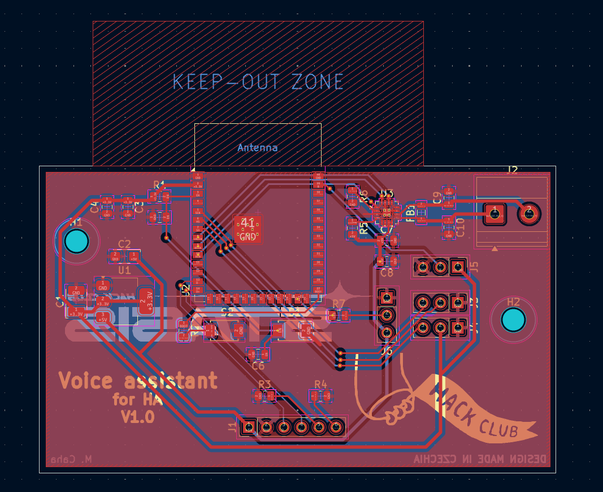

# Voice assistant for HA
A while back, I saw a YouTube video about a voice assistant for [Home Assistant](https://www.home-assistant.io/). I really liked that it activates when you say “Hey Jarvis” and can control various things via voice commands. 
And since I have Home Assistant set up, I thought, why not try building that assistant myself?

I found out that voice recognition can run on the [ESP32-S3-WROOM-1-N16R8](https://m5stack-doc.oss-cn-shenzhen.aliyuncs.com/1183/ESP32-S3-WROOM-1U-N16R8.pdf), so I decided to use it because it’s relatively inexpensive. 
Since I also wanted it to have a high-quality speaker for playing music, the total cost is quite high, but that’s because of the speaker, the custom PCB, and other components. 

I really enjoyed working on this project because I learned a lot of new things. For example, I learned how to properly design a speaker enclosure, since sound quality depends more on the enclosure than on the speaker itself.

## Features
- Power and programming are handled via the **USB-C** port on the back
- The [ESP32-S3](https://m5stack-doc.oss-cn-shenzhen.aliyuncs.com/1183/ESP32-S3-WROOM-1U-N16R8.pdf) is the brain of the entire voice assistant
- It uses [Gemini AI](https://docs.cloud.google.com/vertex-ai/generative-ai/docs/learn/model-versions), [Gemini TTS](https://docs.cloud.google.com/text-to-speech/docs/gemini-tts), and [Gemini STT](https://docs.cloud.google.com/speech-to-text/docs), so it can speak and understand many languages
- It's not just a voice assistant for commands, but also a great AI assistant
- It has internet access, so it can search for information and use it to provide answers
- Everything is accompanied by a light response, so you know exactly what's going on
- It's also a great music player because it features a high-quality [DAYTON DMA45-4](https://www.reproobchod.cz/user/related_files/dma45-4.pdf) speaker
- It has a touch button to mute the assistant hidden in the top cover.

⚠️It is important to have Home Assistant set up and Gemini API, the free API version will work too! You can find instructions on how to connect Gemini to Home Assistant online. Once the project is fully complete, I’ll publish detailed instructions on how to set it all up!

## CAD model
Everything is housed in a box consisting of 5 parts (front panel, rear panel, top panel, body, and a tube connecting the outside to the inside chamber). The touch button is hidden in the top panel, so it can be activated by touch and is not visible from the outside. The interior space behind the speaker must be completely airtight at the front to function properly; it is connected to the outside only by a tube at the back. It is also a good idea to place a piece of cotton wool inside for better sound quality. The PCB is located separately from the space around the speaker; it is secured with M3 screws, just like the rear panel, while the top panel is held in place by magnets. 

  

  <strong>Made in Fusion360</strong>

## PCB

  Schematic

  

  PCB

  

  <strong>Made in KiCad</strong>

## Firmware
This voice assistant uses [ESPHome](https://esphome.io/) firmware. It is programmed via the USB-C port. It is activated by saying "Hey Jarvis" and sends a recording of the command to the [Home Assistant](https://www.home-assistant.io/), where it is converted to text using [Gemini STT](https://docs.cloud.google.com/speech-to-text/docs), then converted into a response using [Gemini AI](https://docs.cloud.google.com/vertex-ai/generative-ai/docs/learn/model-versions), and then converted into a voice response using [Gemini TTS](https://docs.cloud.google.com/text-to-speech/docs/gemini-tts), the action is performed, and the response is spoken. You need to have the voice assistant pipeline set up correctly in Home Assistant! Once I've finished the project, I'll write a guide on how to get it up and running!

## BOM
You can find it in .csv format [here](https://github.com/Matyas604/Voice-assistant-for-HA/blob/main/BOM.csv). 

  Made with ❤️ by <a href="https://github.com/Matyas604">@Matyas604</a>

